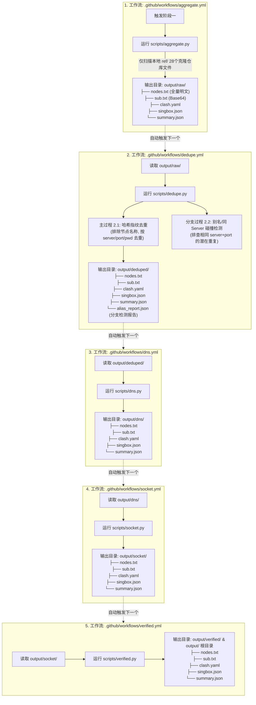

# GitHub Actions 多阶段节点处理与去重分支检测试验方案

十分抱歉之前理解偏误！根据您的指示，对系统架构进行两项关键修正：

1. **绝对离线/纯本地扫描原则**：取消所有运行时在线 API/HTTP 动态请求。节点资源**仅从本地已克隆的 `ref/` 目录下 28 个仓库文件**中进行读取扫描。
2. **阶段二 (去重) 双过程与分支检测**：
   - **主过程 (2.1)**：按核心传输属性 `SHA256(protocol, server, port, credential, path/sni)` 计算哈希指纹。**完全排除节点名称/备注的影响**，确保“同一节点被改名”也能被精准识别并去重。
   - **分支检测过程 (2.2)**：新增端点碰撞与别名潜在重复分支检测，专门排查共享相同 `server + port`（同一台服务器节点）的潜在重复项，生成独立的评估报告 `output/deduped/alias_report.json`，不影响主流水线 1~5 的正常运行。

---

## 一、系统整体架构与多工作流逻辑图

---

## 二、阶段二 (去重) 两个过程的技术实现

### 过程 2.1：哈希指纹主去重算法 (解决改名重复问题)
- **核心逻辑**：
  $$\text{Fingerprint} = \text{SHA256}(\text{Protocol} + \text{Server/IP} + \text{Port} + \text{UUID/Password} + \text{Path/SNI} + \text{PublicKey})$$
- **关键细节**：在计算指纹时，**故意忽略节点的 Name / Remark / Title**。
  - 示例：节点 A 名字为 `"香港01免费"`，节点 B 名字为 `"HK-VIP-Fast"`，若其底层连接地址与密码完全一致，指纹计算结果完全一致，直接被合并为一个节点。

### 过程 2.2：分支过程 (同 Server/IP 端点碰撞检测)
- **核心逻辑**：
  - 检索所有节点中共享相同 `server + port`（即指向同一台机器及对应端口）但使用了不同协议包装或微调参数的节点。
  - 生成 `output/deduped/alias_report.json` 详细报告，标明哪些节点可能是“同一台服务器的不同别名/不同包装”。
  - 该检测仅作为独立报告输出，**不会影响主流水线的正常走向**。

---

## 三、5 个阶段规范目录与输出文件总览

| 处理阶段 | Actions 工作流 | 执行 Python 脚本 | 输出规范目录 | 目录包含的全格式文件列表 |
| :--- | :--- | :--- | :--- | :--- |
| **阶段一：汇总** | `.github/workflows/aggregate.yml` | `scripts/aggregate.py` | `output/raw/` | `nodes.txt` `sub.txt` `clash.yaml` `singbox.json` `summary.json` |
| **阶段二：去重** | `.github/workflows/dedupe.yml` | `scripts/dedupe.py` | `output/deduped/` | `nodes.txt` `sub.txt` `clash.yaml` `singbox.json` `summary.json` `alias_report.json` (分支碰撞报告) |
| **阶段三：DNS** | `.github/workflows/dns.yml` | `scripts/dns.py` | `output/dns/` | `nodes.txt` `sub.txt` `clash.yaml` `singbox.json` `summary.json` |
| **阶段四：Socket** | `.github/workflows/socket.yml` | `scripts/socket.py` | `output/socket/` | `nodes.txt` `sub.txt` `clash.yaml` `singbox.json` `summary.json` |
| **阶段五：204实测** | `.github/workflows/verified.yml` | `scripts/verified.py` | `output/verified/` (及 `output/` 根目录) | `nodes.txt` `sub.txt` `clash.yaml` `singbox.json` `summary.json` |

---

## 四、拟新建文件清单

### 1. 配置文件 (`config/sources.json`)
注册本地 28 个 `ref/` 仓库的路径映射，仅用于本地文件扫描。

### 2. 核心 Python 脚本
- #### [NEW] [scripts/aggregate.py](file:///C:/Users/Ngokel/Desktop/en/example/tvtv/scripts/aggregate.py) (纯本地扫描)
- #### [NEW] [scripts/dedupe.py](file:///C:/Users/Ngokel/Desktop/en/example/tvtv/scripts/dedupe.py) (含过程2.1哈希去重与过程2.2别名碰撞分支检测)
- #### [NEW] [scripts/dns.py](file:///C:/Users/Ngokel/Desktop/en/example/tvtv/scripts/dns.py)
- #### [NEW] [scripts/socket.py](file:///C:/Users/Ngokel/Desktop/en/example/tvtv/scripts/socket.py)
- #### [NEW] [scripts/verified.py](file:///C:/Users/Ngokel/Desktop/en/example/tvtv/scripts/verified.py)
- #### [NEW] [scripts/common.py](file:///C:/Users/Ngokel/Desktop/en/example/tvtv/scripts/common.py)

### 3. GitHub Actions 工作流
- #### [NEW] [.github/workflows/aggregate.yml](file:///C:/Users/Ngokel/Desktop/en/example/tvtv/.github/workflows/aggregate.yml)
- #### [NEW] [.github/workflows/dedupe.yml](file:///C:/Users/Ngokel/Desktop/en/example/tvtv/.github/workflows/dedupe.yml)
- #### [NEW] [.github/workflows/dns.yml](file:///C:/Users/Ngokel/Desktop/en/example/tvtv/.github/workflows/dns.yml)
- #### [NEW] [.github/workflows/socket.yml](file:///C:/Users/Ngokel/Desktop/en/example/tvtv/.github/workflows/socket.yml)
- #### [NEW] [.github/workflows/verified.yml](file:///C:/Users/Ngokel/Desktop/en/example/tvtv/.github/workflows/verified.yml)

---

## 五、验证与测试计划
1. **纯本地读取测试**：在未连接网络状态下测试 `scripts/aggregate.py`，验证其仅对 `ref/` 28个本地文件夹扫描提取。
2. **同节点不同名字去重测试**：构造两个底层连接信息完全一致但名字不同的节点（如 `"HK-01"` 与 `"香港极速"`），验证过程 2.1 能精准将其识别为同一个节点合并，同时验证过程 2.2 在 `alias_report.json` 中记录对应碰撞分析。
