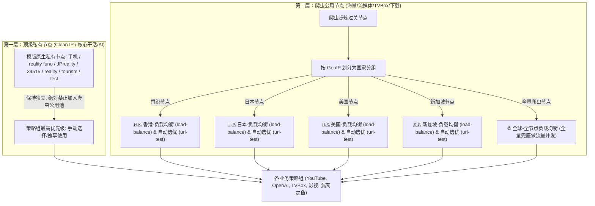

# 双层架构 (私有节点 + 爬虫分国负载均衡) Clash 模版合成方案

本方案完全响应您的需求，在 Clash 规则模版合成引擎（`scripts/template_engine.py`）中设计 **“私有顶级节点防护” 与 “爬虫节点分国负载均衡 (Load-Balance) 兜底” 的双层架构**。

---

## 一、双层架构设计理念 (Private vs Crawled Node Decoupling)

---

## 二、策略组 (Proxy Groups) 动态构建细则

### 1. 分国负载均衡组 (Per-Country Load Balance)
对每个 GeoIP 国家分组，**仅使用爬虫抓取的节点**构建两个高可用策略组：
- **`🇭🇰 香港-负载均衡`**：
  - `type: load-balance`, `strategy: round-robin`, `url: http://www.gstatic.com/generate_204`, `interval: 300`
  - 成员：仅包含爬虫提取的香港节点，实现多节点流量自动分摊。
- **`🇭🇰 香港-自动选优`**：
  - `type: url-test`, `url: http://www.gstatic.com/generate_204`, `interval: 300`
  - 成员：仅包含爬虫提取的香港节点，自动挑选最低延迟节点。

类似地，自动为 `🇯🇵 日本`、`🇺🇸 美国`、`🇸🇬 新加坡`、`🇹🇼 台湾`、`🇰🇷 韩国`、`🇬🇧 英国`、`🇩🇪 德国` 构建对应的负载均衡组。

### 2. 全球全节点兜底负载均衡组 (Global Fallback Load Balance)
- **`🌐 全球-全节点负载均衡`**：
  - `type: load-balance`, `strategy: round-robin`, `url: http://www.gstatic.com/generate_204`, `interval: 300`
  - 成员：包含**所有爬虫提取的节点**。当所有单国负载均衡均不可用时，作为全量并发兜底。
- **`⚡ 全球-全节点自动选优`**：
  - `type: url-test`，包含所有爬虫节点。

---

## 三、业务策略组层级与私有节点保护

对于模版中的所有业务策略组（如 `▶️ YouTube`、`🟢 OpenAI`、`✈️ Telegram`、`🍿 Netflix`、`📺 TVBox代理`、`📥 私有下载/BT` 等），其成员排列严格遵循：

1. **最高优先级**：您的顶级私有节点 (`"手机"`, `"reality funo"`, `"JPreality"`, `"39515"`, `"reality"`, `"tourism"`, `"test"`)
2. **第二优先级**：主选择组 `PROXY`
3. **第三优先级**：单国负载均衡组 (`🇭🇰 香港-负载均衡`, `🇯🇵 日本-负载均衡`, `🇺🇸 美国-负载均衡` ...)
4. **第四优先级**：全球全节点负载均衡组 (`🌐 全球-全节点负载均衡`)
5. **保底兜底**：`DIRECT`, `REJECT`

> [!IMPORTANT]
> **私有节点隔离原则**：私有节点仅作为高级直选选项出现，**绝不写入**任何爬虫节点的 `load-balance`（负载均衡）或 `url-test`（自动测速）公用池中，确保私有节点的干净 IP 不会被爬虫流量稀释或污染。

---

## 四、拟新建与修改的文件清单

### 1. 模版文件
- #### [NEW] [config/rules_template.yaml](file:///C:/Users/Ngokel/Desktop/en/example/tvtv/config/rules_template.yaml)
  - 包含您的 `Untitled-1.yaml` 规则模板。

### 2. 模版合成脚本
- #### [NEW] [scripts/template_engine.py](file:///C:/Users/Ngokel/Desktop/en/example/tvtv/scripts/template_engine.py)
  - 实现私有节点保护 + 爬虫节点分国负载均衡构建 + 全规则注入合成。

### 3. 工作流整合
- #### [MODIFY] [.github/workflows/aggregate.yml](file:///C:/Users/Ngokel/Desktop/en/example/tvtv/.github/workflows/aggregate.yml)
  - 在全流程末端运行 `python scripts/template_engine.py` 并提交生成成果。

---

## 五、验证与测试计划

1. **语法校验**：验证合成的 `clash.yaml` 能在 Clash Verge/Meta 客户端中无错加载，并正确识别 `type: load-balance` 策略组。
2. **隔离性验证**：检查 `🇭🇰 香港-负载均衡` 与 `🌐 全球-全节点负载均衡` 策略组列表，确认绝对**不包含**用户的私有节点。
